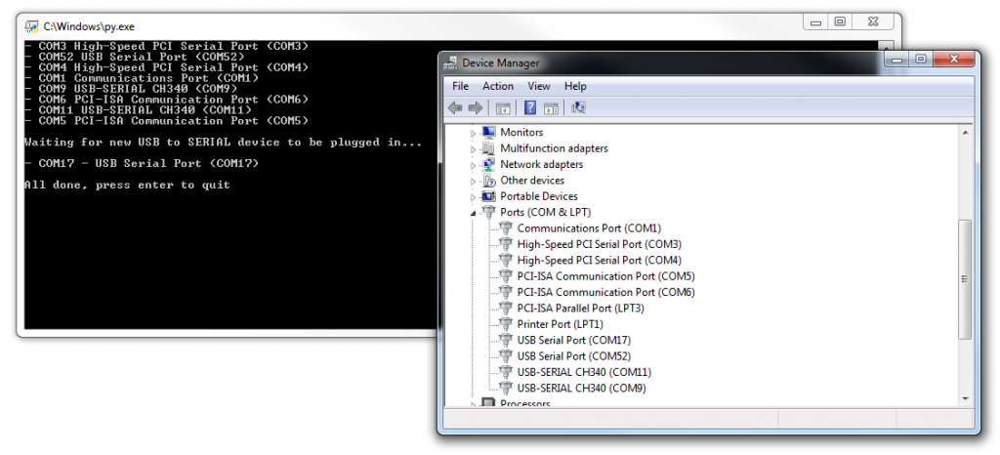

# Discover fresh plugged USB to COM port device number
Provided as test application, can be easily adapted for automated tasks. Link to [original blog post](https://www.kurokesu.com/main/2019/02/01/which-usb-to-com-port-is-the-most-recent-one/)

* Start script
* Script will display current available ports
* Plug USB device
* Script will display new port

